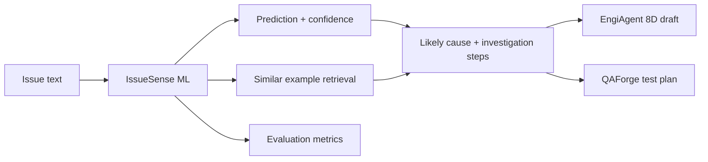

# Engineering Intelligence Suite

Engineering Intelligence Suite is an AI-assisted engineering workflow portfolio. Its system-level function is to convert an engineering issue or test-report finding into an engineering resolution package: triage, likely cause, investigation draft, QA coverage, and human-review readiness.

Implemented modules:

> **IssueSense ML - AI Triage Engine for Engineering Intelligence Suite**
> **EngiAgent - Investigation and 8D Draft Layer**
> **QAForge AI - Requirement-to-Test Coverage Layer**

IssueSense ML is a Python/PyTorch triage engine for classifying engineering issue reports and test-report findings into categories such as software defect, requirement gap, test environment issue, data issue, performance issue, and integration issue. It estimates likely cause, retrieves similar cases, flags uncertainty, and provides next investigation steps.

EngiAgent and QAForge AI are MVP workflow modules connected to IssueSense output. EngiAgent uses a LangChain Core runnable chain to convert a triage result into an investigation summary and 8D draft. QAForge converts a requirement or confirmed risk into test cases, traceability rows, coverage metrics, and QA quality checks.

```text
Engineering Intelligence Suite
|-- IssueSense ML
|   `-- AI triage, likely cause, uncertainty, similar cases, investigation steps
|-- EngiAgent
|   `-- investigation summary, tool trace, 8D workflow draft
`-- QAForge AI
    `-- AI-assisted test design, requirement coverage, QA artifact validation
```

This is not an LLM-training project. The classifier is a supervised ML model trained on a synthetic/curated educational dataset, with lightweight retrieval and workflow layers for explanation and engineering follow-up.

## Labels

- `software_bug`: implementation defect or broken behavior.
- `requirement_gap`: unclear, missing, or conflicting expected behavior.
- `test_environment_issue`: staging, config, network, dependency, or test setup issue.
- `data_issue`: missing, malformed, duplicated, or inconsistent data.
- `performance_issue`: latency, timeout, throughput, or resource usage issue.
- `integration_issue`: service-to-service, API contract, auth, webhook, or third-party integration issue.

## Architecture



## Quick Start

Use a Python environment with PyTorch installed. On this machine, the existing DevBrain venv can run the project:

```powershell
cd D:\GITHUB\Engineering-Intelligence-Suite
& D:\GITHUB\DevBrain-AI-Engineering-Intelligence-Platform\.venv\Scripts\python.exe -m issuesense.generate_dataset
& D:\GITHUB\DevBrain-AI-Engineering-Intelligence-Platform\.venv\Scripts\python.exe -m issuesense.train_baseline
& D:\GITHUB\DevBrain-AI-Engineering-Intelligence-Platform\.venv\Scripts\python.exe -m issuesense.train_pytorch
& D:\GITHUB\DevBrain-AI-Engineering-Intelligence-Platform\.venv\Scripts\python.exe -m issuesense.evaluate
```

Or run the Windows helper:

```powershell
.\scripts\run_pipeline.ps1
```

For a standalone environment:

```powershell
python -m venv .venv
.\.venv\Scripts\python.exe -m pip install -r requirements.txt
.\.venv\Scripts\python.exe -m issuesense.generate_dataset
.\.venv\Scripts\python.exe -m issuesense.train_baseline
.\.venv\Scripts\python.exe -m issuesense.train_pytorch
.\.venv\Scripts\python.exe -m issuesense.evaluate
```

## Local API

Start the Python API:

```powershell
.\scripts\run_api.ps1
```

Available endpoints:

```text
GET  http://127.0.0.1:8765/health
GET  http://127.0.0.1:8765/metrics
GET  http://127.0.0.1:8765/suite/modules
POST http://127.0.0.1:8765/suite/run
POST http://127.0.0.1:8765/predict
POST http://127.0.0.1:8765/engiagent/8d-draft
POST http://127.0.0.1:8765/engiagent/analyze-document
POST http://127.0.0.1:8765/qaforge/generate-tests
```

`POST /suite/run` is the umbrella workflow endpoint. It runs IssueSense ML, EngiAgent, and QAForge AI in sequence and returns one `resolution_package`.

The prediction API returns `likely_cause`, `cause_rationale`, `next_investigation_steps`, and `suite_context`. The React demo includes both the full suite workflow and module-level `Send to EngiAgent` / `Send to QAForge` actions.

## EngiAgent Runtime

EngiAgent is no longer just a static template. The default runtime is:

```text
ENGIAGENT_RUNTIME=langchain
```

With `langchain-core` installed, `POST /engiagent/8d-draft` runs a LangChain Core runnable chain:

```text
issue_intake_parser -> triage_context_router -> eight_d_workflow_builder -> grounding_guardrail
```

The response includes:

- `agent_runtime`: runtime used by the module.
- `agent_plan`: orchestration steps.
- `tool_trace`: tool-level execution trace.
- `guardrails`: completeness and grounding checks.
- `eight_d`: D1-D8 investigation draft.

EngiAgent also supports document intake through `POST /engiagent/analyze-document`.
Upload `.txt`, `.md`, `.log`, `.csv`, `.json`, `.pdf`, or `.docx` files and the module will:

- extract readable text from the document.
- split the document into evidence chunks.
- summarize key findings and risk level.
- pass the grounded evidence into the investigation workflow.
- return a document-backed 8D draft for human review.

If `langchain-core` is missing, the endpoint falls back to `deterministic_fallback` so the demo still runs on a fresh machine.

## Cinematic Web Experience

Start the React/Vite presentation layer:

```powershell
npm.cmd install
npm.cmd run dev
```

Open the local URL printed by Vite, usually:

```text
http://127.0.0.1:5176
```

Build check:

```powershell
npm.cmd run build
```

Important: the React site is the storytelling/demo layer. The model, triage, investigation draft, and QA generation logic are served by the Python code under `issuesense/`.

## Experiment Tracking

Every evaluation run appends a compact JSONL record to `outputs/experiments/runs.jsonl` with:

- run id and timestamp
- synthetic/challenge dataset hashes
- dataset sizes
- accuracy, macro-F1, and latency for each model/split

The latest run is also embedded in `outputs/metrics.json` and served through `GET /metrics`.

## Optional LLM Explanation

By default, explanations are extractive and grounded in similar labeled examples.

To try local Ollama explanation:

```powershell
$env:ISSUESENSE_EXPLANATION_PROVIDER="ollama"
$env:OLLAMA_MODEL="qwen2.5:1.5b-instruct"
.\scripts\run_api.ps1
```

The LLM output is accepted only if it passes a simple grounding check. Otherwise, the system falls back to the extractive explanation.

## Current Results

Latest committed summary:

- Synthetic dataset: 540 generated engineering issue reports.
- Manual challenge set: 36 noisier examples under `data/challenge`.
- Synthetic test: both baseline and PyTorch TextCNN reach 1.000 accuracy / 1.000 macro F1.
- Manual challenge:
  - TF-IDF + Logistic Regression: 0.972 accuracy / 0.972 macro F1.
  - PyTorch TextCNN: 0.861 accuracy / 0.863 macro F1.

See:

- `docs/metrics.md`
- `docs/error-analysis.md`
- `docs/model-card.md`
- `docs/roadmap.md`
- `docs/suite-architecture.md`

## Portfolio Claims

Safe CV wording:

- Built Engineering Intelligence Suite, an AI-assisted engineering workflow system that converts engineering issue reports into triage, 8D investigation drafts, QA test plans, and review-readiness signals.
- Built IssueSense ML, a PyTorch-based AI triage engine that classifies engineering issues, estimates likely cause, retrieves similar cases, and flags uncertain predictions for human review.
- Added EngiAgent, an MVP investigation layer that converts triage findings into evidence summaries, tool traces, and 8D drafts for human review.
- Added QAForge AI, an MVP QA validation layer that generates requirement-linked test cases, traceability rows, coverage metrics, and test artifact quality checks.
- Compared TF-IDF Logistic Regression against a PyTorch TextCNN classifier and documented synthetic-test metrics, manual challenge-set metrics, latency, confusion matrices, and error cases.

Avoid claiming production deployment, proprietary Bosch data, or training a large language model. This project is a local supervised NLP/ML and workflow prototype.
