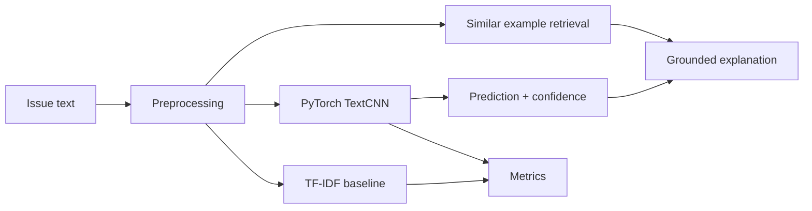

# IssueSense ML

IssueSense ML is a Python/PyTorch project for classifying engineering issue reports and test-report findings into practical categories such as software defect, requirement gap, test environment issue, data issue, performance issue, and integration issue.

The project is designed for an AI Engineer Intern portfolio: it includes dataset generation, preprocessing, baseline modeling, PyTorch training, challenge-set evaluation, confusion matrix analysis, error analysis, and an explanation layer based on similar labeled examples.

## Why This Project

Engineering teams often receive noisy issue reports from testing, QA, APIs, logs, and user workflows. IssueSense ML turns those reports into structured categories so teams can triage faster and explain why a finding was classified a certain way.

This is not an LLM-training project. The classifier is a supervised ML model trained on a synthetic/curated educational dataset, with a lightweight retrieval layer for explanations.

## Labels

- `software_bug`: implementation defect or broken behavior.
- `requirement_gap`: unclear, missing, or conflicting expected behavior.
- `test_environment_issue`: staging, config, network, dependency, or test setup issue.
- `data_issue`: missing, malformed, duplicated, or inconsistent data.
- `performance_issue`: latency, timeout, throughput, or resource usage issue.
- `integration_issue`: service-to-service, API contract, auth, webhook, or third-party integration issue.

## Architecture



## Quick Start

Use a Python environment with PyTorch installed. On this machine, the existing DevBrain venv can run the project:

```powershell
cd D:\GITHUB\IssueSense-ML
& D:\GITHUB\DevBrain-AI-Engineering-Intelligence-Platform\.venv\Scripts\python.exe -m issuesense.generate_dataset
& D:\GITHUB\DevBrain-AI-Engineering-Intelligence-Platform\.venv\Scripts\python.exe -m issuesense.train_baseline
& D:\GITHUB\DevBrain-AI-Engineering-Intelligence-Platform\.venv\Scripts\python.exe -m issuesense.train_pytorch
& D:\GITHUB\DevBrain-AI-Engineering-Intelligence-Platform\.venv\Scripts\python.exe -m issuesense.evaluate
```

Or run the Windows helper:

```powershell
.\scripts\run_pipeline.ps1
```

For a standalone environment:

```powershell
python -m venv .venv
.\.venv\Scripts\python.exe -m pip install -r requirements.txt
.\.venv\Scripts\python.exe -m issuesense.generate_dataset
.\.venv\Scripts\python.exe -m issuesense.train_baseline
.\.venv\Scripts\python.exe -m issuesense.train_pytorch
.\.venv\Scripts\python.exe -m issuesense.evaluate
```

## Demo Prediction

```powershell
& D:\GITHUB\DevBrain-AI-Engineering-Intelligence-Platform\.venv\Scripts\python.exe -m issuesense.predict "Login API returns HTTP 500 when password contains special characters, but expected HTTP 401."
```

Optional Streamlit demo:

```powershell
& D:\GITHUB\DevBrain-AI-Engineering-Intelligence-Platform\.venv\Scripts\python.exe -m streamlit run app\streamlit_app.py
```

Or:

```powershell
.\scripts\run_app.ps1
```

## Cinematic Web Experience

The repository also includes a React/Vite cinematic product experience for portfolio presentation. It is visual-first, but it is connected to the Python model through a local FastAPI endpoint. The live triage console sends issue text to the local classifier and carries the prediction into the AI core and explanation scenes.

Start the Python prediction API:

```powershell
.\scripts\run_api.ps1
```

Then start the cinematic web experience:

```powershell
npm.cmd install
npm.cmd run dev
```

Open the local URL printed by Vite, usually:

```text
http://127.0.0.1:5176
```

Build check:

```powershell
npm.cmd run build
```

Important: the cinematic React site is the storytelling/demo layer. The real prediction is served by the Python code under `issuesense/`, and the measured results are documented in `docs/metrics.md`.

## Current Results

Latest committed summary:

- Synthetic dataset: 540 generated engineering issue reports.
- Manual challenge set: 36 noisier examples under `data/challenge`.
- Synthetic test: both baseline and PyTorch TextCNN reach 1.000 accuracy / 1.000 macro F1.
- Manual challenge:
  - TF-IDF + Logistic Regression: 0.972 accuracy / 0.972 macro F1.
  - PyTorch TextCNN: 0.861 accuracy / 0.863 macro F1.

See:

- `docs/metrics.md`
- `docs/error-analysis.md`
- `docs/model-card.md`
- `docs/roadmap.md`

## Portfolio Claims

Safe CV wording:

- Built a PyTorch-based engineering issue classification system with dataset generation, preprocessing, baseline comparison, model training, and accuracy/F1 evaluation.
- Compared TF-IDF Logistic Regression against a PyTorch TextCNN classifier and documented synthetic-test metrics, manual challenge-set metrics, latency, confusion matrices, and error cases.
- Added a retrieval-based explanation layer that cites similar labeled examples instead of inventing reasons.

Avoid claiming production deployment or training a large language model. This project is a local supervised NLP/ML prototype.
