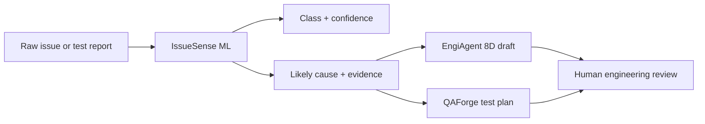

# Engineering Intelligence Suite Architecture

The portfolio is organized as a suite, not as unrelated apps.

```text
Engineering issue / test finding / validation failure
        |
        v
Issue Intake
        |
        v
IssueSense ML
  - issue type classification
  - likely cause estimation
  - similar case retrieval
  - uncertainty / human-review flag
  - next investigation steps
        |
        +----------------------+----------------------+
        |                                             |
        v                                             v
EngiAgent                                      QAForge AI
  - evidence extraction                          - requirement-to-test mapping
  - investigation summary                        - test case generation
  - tool trace                                   - edge-case discovery
  - 8D draft support                            - QA artifact validation
```

## Implemented Modules

### IssueSense ML

AI triage engine for engineering issue classification and root-cause inspection.

Implemented capabilities:

- predicts issue category
- estimates likely cause
- retrieves similar labeled cases
- flags uncertainty for human review
- returns next investigation steps

### EngiAgent

MVP investigation workflow layer for engineering problem solving and 8D assistance.

Implemented capabilities:

- runs a LangChain Core runnable chain by default
- accepts raw report text and optional IssueSense triage context
- extracts evidence snippets
- generates investigation summary
- drafts D1-D8 fields
- returns agent plan, tool trace, guardrails, and memory notes

Endpoint:

```text
POST /engiagent/8d-draft
```

Runtime:

```text
issue_intake_parser -> triage_context_router -> eight_d_workflow_builder -> grounding_guardrail
```

### QAForge AI

MVP AI-assisted QA validation layer for requirement-to-test coverage.

Implemented capabilities:

- accepts requirement text and optional IssueSense triage context
- generates functional, negative, edge, regression, and risk-specific test cases
- builds requirement-to-test traceability rows
- reports coverage metrics
- validates missing expected results, duplicates, weak assertions, and coverage gaps

Endpoint:

```text
POST /qaforge/generate-tests
```

## Workflow



## Why This Positioning Matters

Bosch-style AI engineering work is rarely just a chatbot or a single classifier. The useful system is usually a pipeline:

1. collect data,
2. structure the finding,
3. retrieve evidence,
4. evaluate model output,
5. route the result into a human or agent workflow.

This suite structure shows that the portfolio is built around applied engineering workflows, not isolated demos.
